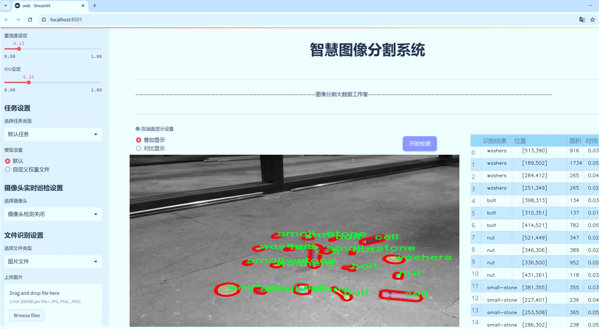
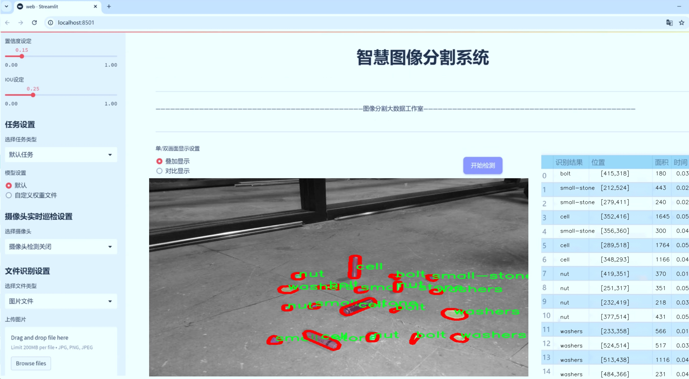
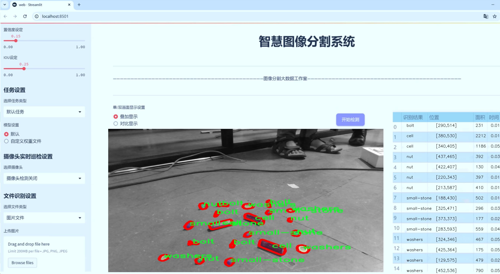
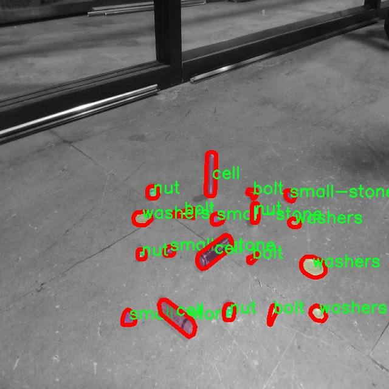

# 地面乱扔垃圾识别图像分割系统源码＆数据集分享
 [yolov8-seg-EfficientRepBiPAN＆yolov8-seg-C2f-CloAtt等50+全套改进创新点发刊_一键训练教程_Web前端展示]

### 1.研究背景与意义

项目参考[ILSVRC ImageNet Large Scale Visual Recognition Challenge](https://gitee.com/YOLOv8_YOLOv11_Segmentation_Studio/projects)

项目来源[AAAI Global Al lnnovation Contest](https://kdocs.cn/l/cszuIiCKVNis)

研究背景与意义

随着城市化进程的加快，城市环境问题日益突出，尤其是地面乱扔垃圾现象严重影响了城市的美观和生态环境。垃圾的随意投放不仅造成了视觉污染，还可能导致土壤和水源的污染，进而对人类健康和生态系统造成威胁。因此，针对地面乱扔垃圾的监测与管理显得尤为重要。传统的垃圾识别方法多依赖人工巡查，效率低下且容易受到主观因素的影响。近年来，计算机视觉技术的快速发展为垃圾识别提供了新的解决方案，尤其是基于深度学习的图像分割技术，能够在复杂环境中实现高效、准确的垃圾识别。

YOLO（You Only Look Once）系列模型因其实时性和高精度而广泛应用于目标检测领域。YOLOv8作为该系列的最新版本，结合了更为先进的特征提取网络和改进的检测算法，能够在保证高准确率的同时，提升检测速度。然而，针对地面乱扔垃圾的具体应用场景，YOLOv8仍存在一定的局限性，尤其是在细粒度的垃圾分类和复杂背景下的图像分割能力。因此，基于改进YOLOv8的地面乱扔垃圾识别图像分割系统的研究具有重要的理论和实践意义。

本研究将利用一个包含1000张图像的数据集，进行地面垃圾的实例分割。该数据集包含五类垃圾物品：螺栓、电池、螺母、小石头和垫圈。这些类别的选择不仅涵盖了日常生活中常见的垃圾类型，也反映了城市环境中潜在的污染源。通过对这些类别的细致分析，可以为城市管理者提供更为精确的垃圾分类信息，从而制定出更为有效的垃圾管理策略。此外，数据集的规模和多样性也为模型的训练和验证提供了坚实的基础，能够有效提升模型的泛化能力。

在技术层面，本研究将对YOLOv8进行改进，结合图像分割技术，提升其在复杂场景下的识别能力。通过引入先进的图像处理算法和数据增强技术，优化模型的训练过程，以提高其对不同类别垃圾的识别精度和鲁棒性。同时，研究还将探讨如何利用深度学习模型的特征提取能力，结合传统的图像处理方法，形成一个高效的垃圾识别与分割系统。

综上所述，基于改进YOLOv8的地面乱扔垃圾识别图像分割系统的研究，不仅能够为城市环境管理提供技术支持，还将推动计算机视觉领域在垃圾识别与处理方面的应用发展。通过实现高效、准确的垃圾识别与分类，本研究有望为改善城市环境、提升居民生活质量做出积极贡献。

### 2.图片演示







##### 注意：由于此博客编辑较早，上面“2.图片演示”和“3.视频演示”展示的系统图片或者视频可能为老版本，新版本在老版本的基础上升级如下：（实际效果以升级的新版本为准）

  （1）适配了YOLOV8的“目标检测”模型和“实例分割”模型，通过加载相应的权重（.pt）文件即可自适应加载模型。

  （2）支持“图片识别”、“视频识别”、“摄像头实时识别”三种识别模式。

  （3）支持“图片识别”、“视频识别”、“摄像头实时识别”三种识别结果保存导出，解决手动导出（容易卡顿出现爆内存）存在的问题，识别完自动保存结果并导出到tempDir中。

  （4）支持Web前端系统中的标题、背景图等自定义修改，后面提供修改教程。

  另外本项目提供训练的数据集和训练教程,暂不提供权重文件（best.pt）,需要您按照教程进行训练后实现图片演示和Web前端界面演示的效果。

### 3.视频演示

[3.1 视频演示](https://www.bilibili.com/video/BV1tt22YPEAN/)

### 4.数据集信息展示

##### 4.1 本项目数据集详细数据（类别数＆类别名）

nc: 5
names: ['bolt', 'cell', 'nut', 'small-stone', 'washers']


##### 4.2 本项目数据集信息介绍

数据集信息展示

在当今环境保护日益受到重视的背景下，地面乱扔垃圾的识别与处理成为了一个重要的研究课题。为此，我们构建了一个专门用于训练改进YOLOv8-seg的地面乱扔垃圾识别图像分割系统的数据集，命名为“FOD Segmentation”。该数据集旨在通过深度学习技术，提升对地面上不同类型垃圾的自动识别和分割能力，从而为环境监测和清理工作提供技术支持。

“FOD Segmentation”数据集包含五个主要类别，分别是：螺栓（bolt）、电池（cell）、螺母（nut）、小石头（small-stone）和垫圈（washers）。这些类别的选择不仅考虑到了常见的地面垃圾类型，还反映了不同物品在环境中对生态的潜在影响。每个类别的物品在现实生活中都可能对环境造成不同程度的污染，因此，准确识别和分割这些物品显得尤为重要。

在数据集的构建过程中，我们采用了多种数据采集技术，以确保数据的多样性和代表性。通过在不同的环境条件下拍摄，数据集涵盖了城市街道、公园、工业区等多种场景，确保模型在各种实际应用场景中的有效性。此外，为了增强模型的鲁棒性，我们还进行了数据增强处理，包括旋转、缩放、翻转和颜色调整等。这些技术手段不仅增加了数据集的样本数量，还提升了模型对不同光照和天气条件的适应能力。

每个类别的图像都经过精细的标注，确保在训练过程中，模型能够准确学习到各类物品的特征。标注过程中，我们采用了高标准的标注规范，确保每个物品的边界清晰可辨。这种高质量的标注为模型的训练提供了坚实的基础，使其能够在分割任务中实现更高的精度。

为了评估模型的性能，我们将数据集划分为训练集、验证集和测试集，确保模型在训练过程中能够有效地学习，同时在验证和测试阶段进行性能评估。通过这种方式，我们能够监控模型的学习进度，及时调整训练策略，以达到最佳的识别效果。

在实际应用中，改进YOLOv8-seg的地面乱扔垃圾识别图像分割系统将能够自动识别和分割地面上的各种垃圾，为环境保护工作提供强有力的技术支持。通过高效的图像分割，系统不仅可以帮助清理人员快速定位垃圾，还可以为城市管理者提供数据支持，优化垃圾清理路线和资源配置。

总之，“FOD Segmentation”数据集的构建与应用，不仅为地面乱扔垃圾的识别提供了重要的数据基础，也为相关领域的研究和实践提供了新的思路和方法。随着技术的不断进步，我们期待该数据集能够在更广泛的环境监测和治理工作中发挥积极作用，为建设美丽城市贡献力量。




### 5.全套项目环境部署视频教程（零基础手把手教学）

[5.1 环境部署教程链接（零基础手把手教学）](https://www.bilibili.com/video/BV1jG4Ve4E9t/?vd_source=bc9aec86d164b67a7004b996143742dc)


[5.2 安装Python虚拟环境创建和依赖库安装视频教程链接（零基础手把手教学）](https://www.bilibili.com/video/BV1nA4VeYEze/?vd_source=bc9aec86d164b67a7004b996143742dc)

### 6.手把手YOLOV8-seg训练视频教程（零基础小白有手就能学会）

[6.1 手把手YOLOV8-seg训练视频教程（零基础小白有手就能学会）](https://www.bilibili.com/video/BV1cA4VeYETe/?vd_source=bc9aec86d164b67a7004b996143742dc)


按照上面的训练视频教程链接加载项目提供的数据集，运行train.py即可开始训练



     Epoch   gpu_mem       box       obj       cls    labels  img_size
     1/200     0G   0.01576   0.01955  0.007536        22      1280: 100%|██████████| 849/849 [14:42<00:00,  1.04s/it]
               Class     Images     Labels          P          R     mAP@.5 mAP@.5:.95: 100%|██████████| 213/213 [01:14<00:00,  2.87it/s]
                 all       3395      17314      0.994      0.957      0.0957      0.0843

     Epoch   gpu_mem       box       obj       cls    labels  img_size
     2/200     0G   0.01578   0.01923  0.007006        22      1280: 100%|██████████| 849/849 [14:44<00:00,  1.04s/it]
               Class     Images     Labels          P          R     mAP@.5 mAP@.5:.95: 100%|██████████| 213/213 [01:12<00:00,  2.95it/s]
                 all       3395      17314      0.996      0.956      0.0957      0.0845

     Epoch   gpu_mem       box       obj       cls    labels  img_size
     3/200     0G   0.01561    0.0191  0.006895        27      1280: 100%|██████████| 849/849 [10:56<00:00,  1.29it/s]
               Class     Images     Labels          P          R     mAP@.5 mAP@.5:.95: 100%|███████   | 187/213 [00:52<00:00,  4.04it/s]
                 all       3395      17314      0.996      0.957      0.0957      0.0845


### 7.50+种全套YOLOV8-seg创新点代码加载调参视频教程（一键加载写好的改进模型的配置文件）

[7.1 50+种全套YOLOV8-seg创新点代码加载调参视频教程（一键加载写好的改进模型的配置文件）](https://www.bilibili.com/video/BV1Hw4VePEXv/?vd_source=bc9aec86d164b67a7004b996143742dc)

### 8.YOLOV8-seg图像分割算法原理

原始YOLOv8-seg算法原理

YOLOv8-seg算法是YOLO系列中最新的目标检测与分割模型，它在YOLOv8的基础上进行了扩展，增加了对图像分割任务的支持。该算法的设计理念在于将目标检测与实例分割相结合，以实现对图像中物体的精确定位和形状提取。YOLOv8-seg的架构依然遵循YOLO系列的高效设计原则，包含输入层、主干网络、颈部网络和头部网络等核心组件，但在此基础上，增加了针对分割任务的特定模块，使得模型能够同时处理目标检测和分割问题。

在输入阶段，YOLOv8-seg首先对输入图像进行预处理，包括缩放和归一化，以满足模型的输入要求。该过程确保了输入数据的一致性，并为后续的特征提取打下基础。主干网络采用了CSPDarknet结构，这是一种经过优化的深度卷积神经网络，能够有效提取图像中的多层次特征。CSPDarknet通过将特征图分为多个分支，结合残差学习的思想，增强了模型的表达能力和梯度流动性。每个卷积层后都紧跟着批归一化和SiLU激活函数，这样的设计不仅加速了训练过程，还提高了模型的非线性表达能力。

在特征提取的过程中，YOLOv8-seg引入了C2f模块，这一模块通过跨层连接的方式，进一步提升了特征的多样性和丰富性。C2f模块将输入特征图分为两个分支，每个分支通过卷积操作进行降维处理，最终将多个分支的输出融合在一起，形成更高维度的特征图。这种设计不仅提高了特征提取的效率，还有效减少了模型的参数量，降低了计算复杂度。主干网络的末尾使用了SPPFl块，该模块通过多个最大池化层对多尺度特征进行处理，增强了网络对不同尺度物体的适应能力。

在颈部网络部分，YOLOv8-seg采用了特征金字塔网络（FPN）和路径聚合网络（PAN）的组合结构。这一结构的设计旨在融合来自不同尺度的特征图信息，使得模型能够在多尺度的上下文中进行更为精确的目标检测和分割。FPN通过自底向上的方式提取高层特征，并通过自顶向下的方式进行特征融合，而PAN则通过路径聚合的方式增强了特征的传递和表达能力。这样的设计使得YOLOv8-seg能够在处理复杂场景时，依然保持较高的检测和分割精度。

在头部网络中，YOLOv8-seg采用了解耦的检测头，通过两个并行的卷积分支分别计算目标的回归和分类损失。这种解耦设计使得模型在处理目标检测和分割任务时，能够更为高效地优化损失函数，从而提高了整体性能。此外，YOLOv8-seg还引入了无锚框（Anchor-Free）的检测方式，直接预测目标的中心点和宽高比例，这一创新显著简化了模型的设计，并提高了检测速度和准确度。

在分割任务的实现上，YOLOv8-seg通过引入特定的分割头部网络，利用深度学习技术对物体的边界进行精确预测。该分割头通过对特征图进行上采样和卷积操作，生成与输入图像相同尺寸的分割掩码。通过这种方式，YOLOv8-seg不仅能够识别图像中的物体，还能够为每个物体生成精确的分割区域，从而实现实例分割的目标。

总的来说，YOLOv8-seg算法通过结合YOLOv8的高效特征提取与目标检测能力，进一步扩展了其在图像分割领域的应用。该算法在设计上充分考虑了模型的计算效率与检测精度，利用创新的网络结构和损失计算策略，使得YOLOv8-seg在目标检测与分割任务中都表现出色。随着YOLOv8-seg的不断发展与优化，它有望在更广泛的应用场景中发挥重要作用，为计算机视觉领域带来新的突破。


### 9.系统功能展示（检测对象为举例，实际内容以本项目数据集为准）

图9.1.系统支持检测结果表格显示

  图9.2.系统支持置信度和IOU阈值手动调节

  图9.3.系统支持自定义加载权重文件best.pt(需要你通过步骤5中训练获得)

  图9.4.系统支持摄像头实时识别

  图9.5.系统支持图片识别

  图9.6.系统支持视频识别

  图9.7.系统支持识别结果文件自动保存

  图9.8.系统支持Excel导出检测结果数据


### 10.50+种全套YOLOV8-seg创新点原理讲解（非科班也可以轻松写刊发刊，V11版本正在科研待更新）

#### 10.1 由于篇幅限制，每个创新点的具体原理讲解就不一一展开，具体见下列网址中的创新点对应子项目的技术原理博客网址【Blog】：


[10.1 50+种全套YOLOV8-seg创新点原理讲解链接](https://gitee.com/qunmasj/good)

#### 10.2 部分改进模块原理讲解(完整的改进原理见上图和技术博客链接)【如果此小节的图加载失败可以通过CSDN或者Github搜索该博客的标题访问原始博客，原始博客图片显示正常】
### 全维动态卷积ODConv
鉴于上述讨论，我们的ODConv引入了一种多维注意机制，该机制具有并行策略，用于学习卷积核在核空间的所有四个维度上的不同注意。图提供了CondConv、DyConv和ODConv的示意性比较。

ODConv的公式：根据等式1中的符号，ODConv可定义为


 将注意力标量分配给整个卷积核。图2示出了将这四种类型的关注乘以n个卷积核的过程。原则上，这四种类型的关注是相互补充的，并且以位置、信道、滤波器和核的顺序将它们逐步乘以卷积核 
 ，使得卷积运算不同w.r.t.所有空间位置、所有输入信道、所有滤波器和输入x的所有核，提供捕获丰富上下文线索的性能保证。因此，ODConv可以显著增强CNN基本卷积运算的特征提取能力。此外，具有单个卷积核的ODConv可以与标准CondConv和DyConv竞争或优于它们，为最终模型引入的额外参数大大减少。提供了大量实验来验证这些优点。通过比较等式1和等式2，我们可以清楚地看到，ODConv是一种更广义的动态卷积。此外，当设置n=1且 所有分量均为1时，只关注滤波器方向 的ODConv将减少为：将基于输入特征的SE变量应用于卷积滤波器，然后进行卷积运算（注意原始SE（Hu等人，2018b）基于输出特征，并且用于重新校准输出特征本身）。这种SE变体是ODConv的特例。


图：将ODConv中的四种注意类型逐步乘以卷积核的示例。（a） 沿空间维度的逐位置乘法运算，（b）沿输入信道维度的逐信道乘法运算、（c）沿输出信道维度的按滤波器乘法运算，以及（d）沿卷积核空间的核维度的按核乘法运算。方法部分对符号进行了说明
实现：对于ODConv，一个关键问题是如何计算卷积核的四种关注度 。继CondConv和DyConv之后，我们还使用SE型注意力模块（Hu等人，2018b），但将多个头部作为来计算它们，其结构如图所示。具体而言，首先通过逐通道全局平均池（GAP）运算将输入压缩到具有长度的特征向量中。随后，存在完全连接（FC）层和四个头部分支。ReLU（Krizhevsky等人，2012）位于FC层之后。FC层将压缩特征向量映射到具有缩减比的低维空间（根据消融实验，我们在所有主要实验中设置 ，避免了高模型复杂度）。对于四个头部分支，每个分支都有一个输出大小如图。

### 引入ODConv的改进YOLO
参考这篇博客涵盖了引入ODConv的改进YOLOv8系统的内容，ODConv采用多维注意机制，在卷积核空间的四个维度上学习不同的注意。结合了CondConv和DyConv的优势，ODConv通过图示的四种注意类型逐步与卷积核相乘，以捕获丰富的上下文线索，提升特征提取能力。

#### ODConv结构与方法
ODConv的公式和图示展示了其关注力分配给卷积核的方式，其中四种类型的关注以位置、信道、滤波器和核的顺序逐步与卷积核相乘。这种结构保证了卷积运算不同于标准的Conv操作，能够捕获更多上下文信息，从而增强了CNN的特征提取能力。另外，单个卷积核的ODConv在性能上能够与CondConv和DyConv相竞争，并且引入的额外参数大幅减少。

ODConv的特殊之处在于其广义的动态卷积性质，同时在特定条件下（n=1且所有分量为1），它可以退化为一种特例，即只关注滤波器方向，这类似于基于输入特征的SE变体，但不同于原始SE，它基于输出特征。

#### ODConv的实现
关键问题在于如何计算卷积核的四种关注度。ODConv采用了SE型注意力模块，结合了多个头部来计算这些关注度。具体实现上，通过逐通道全局平均池运算和完全连接层，将输入压缩为特征向量，随后使用四个头部分支来计算四种不同类型的关注。这样的结构能在保持模型复杂度可控的情况下，提升了特征的表征能力。

ODConv的引入为YOLOv8带来了显著的性能提升，并且通过大量实验证明了其在特征提取方面的优越性。其结合了多维注意机制和卷积操作，为目标检测和分拣系统的提升带来了新的思路和性能突破。


### 11.项目核心源码讲解（再也不用担心看不懂代码逻辑）

#### 11.1 ultralytics\hub\auth.py

以下是对给定代码的核心部分进行分析和详细注释的结果：

```python
import requests  # 导入requests库，用于发送HTTP请求

# 设定API的根URL
from ultralytics.hub.utils import HUB_API_ROOT, HUB_WEB_ROOT, PREFIX, request_with_credentials
from ultralytics.utils import LOGGER, SETTINGS, emojis, is_colab

API_KEY_URL = f'{HUB_WEB_ROOT}/settings?tab=api+keys'  # API密钥设置的URL

class Auth:
    """
    处理身份验证过程，包括API密钥处理、基于cookie的身份验证和头部生成。

    支持的身份验证方法：
    1. 直接使用API密钥。
    2. 使用浏览器cookie进行身份验证（特别是在Google Colab中）。
    3. 提示用户输入API密钥。

    属性：
        id_token (str or bool): 用于身份验证的令牌，初始化为False。
        api_key (str or bool): 用于身份验证的API密钥，初始化为False。
        model_key (bool): 模型密钥的占位符，初始化为False。
    """
    id_token = api_key = model_key = False  # 初始化属性

    def __init__(self, api_key='', verbose=False):
        """
        初始化Auth类，接受可选的API密钥。

        参数：
            api_key (str, optional): 可能是API密钥或组合的API密钥和模型ID。
        """
        api_key = api_key.split('_')[0]  # 如果API密钥包含模型ID，分割并保留API密钥部分
        self.api_key = api_key or SETTINGS.get('api_key', '')  # 设置API密钥

        if self.api_key:  # 如果提供了API密钥
            if self.api_key == SETTINGS.get('api_key'):  # 检查API密钥是否匹配
                if verbose:
                    LOGGER.info(f'{PREFIX}Authenticated ✅')  # 记录已认证信息
                return
            else:
                success = self.authenticate()  # 尝试使用提供的API密钥进行认证
        elif is_colab():  # 如果没有提供API密钥且在Google Colab环境中
            success = self.auth_with_cookies()  # 尝试使用cookie进行认证
        else:
            success = self.request_api_key()  # 请求API密钥

        if success:  # 如果认证成功
            SETTINGS.update({'api_key': self.api_key})  # 更新设置中的API密钥
            if verbose:
                LOGGER.info(f'{PREFIX}New authentication successful ✅')  # 记录新认证成功信息
        elif verbose:
            LOGGER.info(f'{PREFIX}Retrieve API key from {API_KEY_URL}')  # 提示获取API密钥的URL

    def request_api_key(self, max_attempts=3):
        """
        提示用户输入他们的API密钥。

        返回值：
            bool: 如果认证成功返回True。
        """
        import getpass  # 导入getpass库以安全输入
        for attempts in range(max_attempts):  # 最多尝试max_attempts次
            LOGGER.info(f'{PREFIX}Login. Attempt {attempts + 1} of {max_attempts}')  # 记录尝试次数
            input_key = getpass.getpass(f'Enter API key from {API_KEY_URL} ')  # 安全输入API密钥
            self.api_key = input_key.split('_')[0]  # 去除模型ID
            if self.authenticate():  # 尝试认证
                return True  # 认证成功
        raise ConnectionError(emojis(f'{PREFIX}Failed to authenticate ❌'))  # 认证失败

    def authenticate(self) -> bool:
        """
        尝试使用id_token或API密钥进行服务器认证。

        返回值：
            bool: 如果认证成功返回True，否则返回False。
        """
        try:
            header = self.get_auth_header()  # 获取认证头
            if header:
                r = requests.post(f'{HUB_API_ROOT}/v1/auth', headers=header)  # 发送认证请求
                if not r.json().get('success', False):  # 检查响应是否成功
                    raise ConnectionError('Unable to authenticate.')  # 认证失败
                return True  # 认证成功
            raise ConnectionError('User has not authenticated locally.')  # 本地未认证
        except ConnectionError:
            self.id_token = self.api_key = False  # 重置无效的令牌
            LOGGER.warning(f'{PREFIX}Invalid API key ⚠️')  # 记录无效API密钥警告
            return False  # 认证失败

    def auth_with_cookies(self) -> bool:
        """
        尝试通过cookie获取认证并设置id_token。用户必须在支持的浏览器中登录HUB。

        返回值：
            bool: 如果认证成功返回True，否则返回False。
        """
        if not is_colab():  # 仅在Colab中有效
            return False
        try:
            authn = request_with_credentials(f'{HUB_API_ROOT}/v1/auth/auto')  # 请求自动认证
            if authn.get('success', False):  # 检查是否成功
                self.id_token = authn.get('data', {}).get('idToken', None)  # 获取id_token
                self.authenticate()  # 尝试认证
                return True  # 认证成功
            raise ConnectionError('Unable to fetch browser authentication details.')  # 获取认证信息失败
        except ConnectionError:
            self.id_token = False  # 重置无效的id_token
            return False  # 认证失败

    def get_auth_header(self):
        """
        获取用于API请求的认证头。

        返回值：
            (dict): 如果设置了id_token或API密钥，则返回认证头，否则返回None。
        """
        if self.id_token:
            return {'authorization': f'Bearer {self.id_token}'}  # 使用id_token生成认证头
        elif self.api_key:
            return {'x-api-key': self.api_key}  # 使用API密钥生成认证头
        return None  # 否则返回None
```

### 代码核心部分说明：
1. **Auth类**：负责处理身份验证，包括API密钥和cookie的使用。
2. **初始化方法**：根据提供的API密钥或环境（如Colab）进行身份验证。
3. **request_api_key方法**：提示用户输入API密钥并进行认证。
4. **authenticate方法**：通过API密钥或id_token与服务器进行认证。
5. **auth_with_cookies方法**：在Colab环境中通过cookie进行身份验证。
6. **get_auth_header方法**：生成用于API请求的认证头部。

这些核心部分是身份验证过程的关键，确保用户能够安全地访问API。

这个文件是一个用于管理认证过程的Python类，名为`Auth`，主要用于处理API密钥、基于cookie的认证以及生成请求头。该类支持多种认证方式，包括直接使用API密钥、使用浏览器cookie进行认证（特别是在Google Colab环境中），以及提示用户输入API密钥。

在类的属性中，`id_token`、`api_key`和`model_key`都被初始化为`False`，其中`id_token`用于身份验证，`api_key`用于API访问，`model_key`是一个占位符。

构造函数`__init__`接受一个可选的API密钥参数。如果提供了API密钥，它会尝试将其与设置中的API密钥进行比较。如果匹配，表示用户已经登录；如果不匹配，则尝试进行认证。如果没有提供API密钥且当前环境是Google Colab，则尝试使用浏览器cookie进行认证；否则，系统会请求用户输入API密钥。

`request_api_key`方法会提示用户输入API密钥，最多尝试三次。如果用户输入的密钥能够成功认证，则返回`True`，否则抛出连接错误。

`authenticate`方法尝试使用`id_token`或API密钥与服务器进行认证。如果认证成功，返回`True`，否则返回`False`并记录警告信息。

`auth_with_cookies`方法专门用于在Google Colab环境中通过cookie进行认证。如果成功获取到cookie信息，将其存储为`id_token`并进行认证。

`get_auth_header`方法用于生成API请求的认证头。如果`id_token`或`api_key`存在，则返回相应的认证头字典；如果都不存在，则返回`None`。

总的来说，这个文件提供了一套完整的认证机制，方便用户在不同环境下安全地访问API。

#### 11.2 ultralytics\data\annotator.py

以下是代码中最核心的部分，并附上详细的中文注释：

```python
from pathlib import Path
from ultralytics import SAM, YOLO

def auto_annotate(data, det_model='yolov8x.pt', sam_model='sam_b.pt', device='', output_dir=None):
    """
    自动标注图像，使用YOLO目标检测模型和SAM分割模型。

    参数:
        data (str): 包含待标注图像的文件夹路径。
        det_model (str, optional): 预训练的YOLO检测模型，默认为'yolov8x.pt'。
        sam_model (str, optional): 预训练的SAM分割模型，默认为'sam_b.pt'。
        device (str, optional): 模型运行的设备，默认为空字符串（CPU或可用的GPU）。
        output_dir (str | None | optional): 保存标注结果的目录。
            默认为与'data'相同目录下的'labels'文件夹。

    示例:
        auto_annotate(data='ultralytics/assets', det_model='yolov8n.pt', sam_model='mobile_sam.pt')
    """
    # 加载YOLO目标检测模型
    det_model = YOLO(det_model)
    # 加载SAM分割模型
    sam_model = SAM(sam_model)

    # 将数据路径转换为Path对象
    data = Path(data)
    # 如果未指定输出目录，则创建一个默认的输出目录
    if not output_dir:
        output_dir = data.parent / f'{data.stem}_auto_annotate_labels'
    # 创建输出目录（如果不存在）
    Path(output_dir).mkdir(exist_ok=True, parents=True)

    # 使用YOLO模型对数据进行检测，stream=True表示流式处理
    det_results = det_model(data, stream=True, device=device)

    # 遍历检测结果
    for result in det_results:
        # 获取检测到的类别ID
        class_ids = result.boxes.cls.int().tolist()  # noqa
        # 如果检测到的类别ID不为空
        if len(class_ids):
            # 获取边界框坐标
            boxes = result.boxes.xyxy  # Boxes对象用于边界框输出
            # 使用SAM模型进行分割，传入边界框
            sam_results = sam_model(result.orig_img, bboxes=boxes, verbose=False, save=False, device=device)
            # 获取分割结果
            segments = sam_results[0].masks.xyn  # noqa

            # 将分割结果写入文本文件
            with open(f'{str(Path(output_dir) / Path(result.path).stem)}.txt', 'w') as f:
                for i in range(len(segments)):
                    s = segments[i]
                    # 如果分割结果为空，则跳过
                    if len(s) == 0:
                        continue
                    # 将分割结果转换为字符串并写入文件
                    segment = map(str, segments[i].reshape(-1).tolist())
                    f.write(f'{class_ids[i]} ' + ' '.join(segment) + '\n')
```

### 代码核心部分说明：
1. **模型加载**：加载YOLO和SAM模型以进行目标检测和图像分割。
2. **输出目录处理**：根据输入数据路径创建输出目录，以存储标注结果。
3. **目标检测**：使用YOLO模型对输入数据进行检测，获取检测结果。
4. **图像分割**：根据YOLO检测结果中的边界框，使用SAM模型进行图像分割。
5. **结果保存**：将分割结果和对应的类别ID写入文本文件，以便后续使用。

这个程序文件是一个用于自动标注图像的工具，主要依赖于YOLO（You Only Look Once）目标检测模型和SAM（Segment Anything Model）分割模型。其核心功能是对指定文件夹中的图像进行处理，生成相应的标注文件。

首先，程序导入了必要的库，包括`Path`用于处理文件路径，以及`SAM`和`YOLO`这两个模型类。接着定义了一个名为`auto_annotate`的函数，该函数接受多个参数：`data`是待标注图像的文件夹路径，`det_model`是预训练的YOLO检测模型的文件名，`sam_model`是预训练的SAM分割模型的文件名，`device`指定运行模型的设备（如CPU或GPU），`output_dir`是保存标注结果的目录。

在函数内部，首先实例化YOLO和SAM模型。接着，使用`Path`将`data`转换为路径对象，并根据是否提供`output_dir`来确定输出目录。如果没有提供输出目录，程序会自动创建一个名为`{data.stem}_auto_annotate_labels`的文件夹。

然后，程序调用YOLO模型对输入数据进行检测，得到检测结果。对于每个检测结果，提取出分类ID和边界框（bounding boxes）。如果检测到目标，程序会使用SAM模型对原始图像进行分割，传入检测到的边界框。分割结果会被提取出来，并以特定格式写入到文本文件中，文件名与原始图像相同，后缀为`.txt`。

在写入标注文件时，程序会遍历每个分割结果，检查其有效性，并将分类ID与对应的分割坐标写入文件。每一行代表一个目标的标注信息，包括类别和分割坐标。

总体而言，这段代码实现了从图像到标注文件的自动化处理，利用YOLO进行目标检测，再通过SAM进行精确的分割，最终生成可用于训练或评估的标注数据。

#### 11.3 ui.py

以下是经过简化并添加详细中文注释的核心代码部分：

```python
import sys
import subprocess

def run_script(script_path):
    """
    使用当前 Python 环境运行指定的脚本。

    Args:
        script_path (str): 要运行的脚本路径

    Returns:
        None
    """
    # 获取当前 Python 解释器的路径
    python_path = sys.executable

    # 构建运行命令，使用 streamlit 运行指定的脚本
    command = f'"{python_path}" -m streamlit run "{script_path}"'

    # 执行命令，并等待其完成
    result = subprocess.run(command, shell=True)
    
    # 检查命令执行结果，如果返回码不为0，则表示出错
    if result.returncode != 0:
        print("脚本运行出错。")

# 主程序入口
if __name__ == "__main__":
    # 指定要运行的脚本路径
    script_path = "web.py"  # 假设脚本在当前目录下

    # 调用函数运行指定的脚本
    run_script(script_path)
```

### 代码说明：
1. **导入模块**：
   - `sys`：用于获取当前 Python 解释器的路径。
   - `subprocess`：用于执行外部命令。

2. **`run_script` 函数**：
   - 该函数接收一个脚本路径作为参数，并使用当前 Python 环境运行该脚本。
   - 使用 `sys.executable` 获取当前 Python 解释器的路径。
   - 构建一个命令字符串，该命令使用 `streamlit` 模块运行指定的脚本。
   - 使用 `subprocess.run` 执行构建的命令，并等待其完成。
   - 检查命令的返回码，如果不为0，则打印错误信息。

3. **主程序入口**：
   - 使用 `if __name__ == "__main__":` 确保只有在直接运行该脚本时才会执行以下代码。
   - 指定要运行的脚本路径（这里假设脚本在当前目录下）。
   - 调用 `run_script` 函数，传入脚本路径以执行该脚本。

这个程序文件名为 `ui.py`，其主要功能是通过当前的 Python 环境运行一个指定的脚本。程序首先导入了必要的模块，包括 `sys`、`os` 和 `subprocess`，以及一个自定义的路径处理模块 `abs_path`。

在 `run_script` 函数中，程序接收一个参数 `script_path`，该参数是要运行的脚本的路径。函数首先获取当前 Python 解释器的路径，接着构建一个命令字符串，该命令使用 `streamlit` 模块来运行指定的脚本。具体来说，命令格式为 `"{python_path}" -m streamlit run "{script_path}"`，其中 `python_path` 是当前 Python 解释器的路径，`script_path` 是传入的脚本路径。

然后，程序使用 `subprocess.run` 方法执行构建好的命令，并通过 `shell=True` 参数在 shell 中运行该命令。执行后，程序检查返回的结果，如果返回码不为 0，表示脚本运行出错，则打印出错信息。

在文件的最后部分，程序通过 `if __name__ == "__main__":` 语句来确保当该文件作为主程序运行时，以下代码才会被执行。这里指定了要运行的脚本路径为 `web.py`，并调用 `run_script` 函数来执行这个脚本。

总体而言，这个程序的作用是为用户提供一个简单的接口，通过当前的 Python 环境来运行一个 Streamlit 应用脚本，便于开发和测试。

#### 11.4 model.py

以下是经过简化和详细注释的核心代码部分：

```python
# -*- coding: utf-8 -*-
import cv2  # 导入OpenCV库，用于处理图像和视频
import torch  # 导入PyTorch库，用于深度学习模型的处理
from QtFusion.models import Detector  # 从QtFusion库中导入Detector抽象基类
from chinese_name_list import Chinese_name  # 导入中文名称字典
from ultralytics import YOLO  # 导入YOLO类，用于加载YOLO模型
from ultralytics.utils.torch_utils import select_device  # 导入选择设备的函数

# 根据是否有可用的GPU选择设备
device = "cuda:0" if torch.cuda.is_available() else "cpu"

# 初始化参数字典
ini_params = {
    'device': device,  # 设备类型
    'conf': 0.3,  # 物体置信度阈值
    'iou': 0.05,  # IOU阈值用于非极大值抑制
    'classes': None,  # 类别过滤器
    'verbose': False  # 是否详细输出
}

class Web_Detector(Detector):  # 定义Web_Detector类，继承自Detector类
    def __init__(self, params=None):  # 构造函数
        super().__init__(params)  # 调用父类构造函数
        self.model = None  # 初始化模型为None
        self.names = list(Chinese_name.values())  # 获取所有类别的中文名称
        self.params = params if params else ini_params  # 设置参数

    def load_model(self, model_path):  # 加载模型的方法
        self.device = select_device(self.params['device'])  # 选择设备
        task = 'segment' if os.path.basename(model_path)[:3] == 'seg' else 'detect'  # 根据模型类型设置任务
        self.model = YOLO(model_path, task=task)  # 加载YOLO模型
        names_dict = self.model.names  # 获取类别名称字典
        # 将类别名称转换为中文
        self.names = [Chinese_name[v] if v in Chinese_name else v for v in names_dict.values()]  
        # 预热模型
        self.model(torch.zeros(1, 3, *[640] * 2).to(self.device).type_as(next(self.model.model.parameters())))

    def predict(self, img):  # 预测方法
        results = self.model(img, **ini_params)  # 使用模型进行预测
        return results  # 返回预测结果

    def postprocess(self, pred):  # 后处理方法
        results = []  # 初始化结果列表
        for res in pred[0].boxes:  # 遍历预测结果中的每个边界框
            for box in res:  # 遍历每个边界框
                class_id = int(box.cls.cpu())  # 获取类别ID
                bbox = box.xyxy.cpu().squeeze().tolist()  # 获取边界框坐标
                bbox = [int(coord) for coord in bbox]  # 转换为整数

                result = {
                    "class_name": self.names[class_id],  # 类别名称
                    "bbox": bbox,  # 边界框
                    "score": box.conf.cpu().squeeze().item(),  # 置信度
                    "class_id": class_id,  # 类别ID
                    "mask": pred[0].masks[0].xy if pred[0].masks is not None else None  # 获取掩膜
                }
                results.append(result)  # 添加结果到列表

        return results  # 返回结果列表
```

### 代码说明：
1. **库导入**：导入了必要的库，包括OpenCV、PyTorch、YOLO模型和中文名称字典。
2. **设备选择**：根据是否有可用的GPU选择设备。
3. **参数初始化**：设置了YOLO模型的基本参数，包括设备类型、置信度阈值等。
4. **Web_Detector类**：定义了一个检测器类，继承自Detector，包含模型加载、预测和后处理的方法。
5. **模型加载**：根据模型路径加载YOLO模型，并将类别名称转换为中文。
6. **预测方法**：对输入图像进行预测，返回结果。
7. **后处理方法**：对预测结果进行处理，提取类别名称、边界框、置信度等信息，并返回处理后的结果列表。

这个程序文件`model.py`主要用于实现一个基于YOLO模型的目标检测器，结合了OpenCV和PyTorch等库，能够处理图像并进行目标检测。首先，程序导入了必要的库，包括OpenCV用于图像处理，PyTorch用于深度学习，QtFusion中的Detector和HeatmapGenerator类，以及Ultralytics库中的YOLO模型和设备选择工具。

接下来，程序定义了一些初始化参数，如设备类型（使用CUDA或CPU）、物体置信度阈值、IOU阈值、类别过滤器等。这些参数用于控制目标检测的行为。

`count_classes`函数用于统计检测结果中每个类别的数量。它接收检测信息和类别名称列表，遍历检测信息，更新每个类别的计数，并最终返回一个按类别顺序排列的计数列表。

`Web_Detector`类继承自`Detector`类，主要负责加载YOLO模型、处理图像、进行预测和后处理。构造函数中，类初始化了一些属性，包括模型、图像和类别名称。`load_model`方法用于加载指定路径的YOLO模型，并根据模型类型（分割或检测）进行相应处理。它还会预热模型，以提高后续预测的速度。

`preprocess`方法用于对输入图像进行预处理，当前实现只是简单地保存原始图像并返回。`predict`方法调用YOLO模型进行预测，返回检测结果。`postprocess`方法则对预测结果进行后处理，提取每个检测框的类别名称、边界框坐标、置信度和类别ID，并将这些信息组织成字典形式，最终返回一个结果列表。

最后，`set_param`方法允许更新检测器的参数，方便用户根据需要调整检测行为。整体来看，这个程序文件实现了一个完整的目标检测流程，从模型加载到图像处理、预测和结果整理，适合用于实际的目标检测任务。

#### 11.5 ultralytics\models\rtdetr\__init__.py

以下是代码中最核心的部分，并附上详细的中文注释：

```python
# 导入必要的模块和类
from .model import RTDETR  # 从当前包中导入 RTDETR 模型类
from .predict import RTDETRPredictor  # 从当前包中导入 RTDETR 预测器类
from .val import RTDETRValidator  # 从当前包中导入 RTDETR 验证器类

# 定义模块的公开接口
__all__ = 'RTDETRPredictor', 'RTDETRValidator', 'RTDETR'  # 指定可以被外部访问的类
```

### 代码解释：
1. **导入模块**：
   - `from .model import RTDETR`：从当前包中导入 `RTDETR` 类，这通常是一个模型定义，用于目标检测或其他任务。
   - `from .predict import RTDETRPredictor`：导入 `RTDETRPredictor` 类，该类负责使用 `RTDETR` 模型进行预测。
   - `from .val import RTDETRValidator`：导入 `RTDETRValidator` 类，该类用于验证模型的性能，通常涉及评估模型在验证集上的表现。

2. **定义公开接口**：
   - `__all__` 是一个特殊变量，用于定义当使用 `from module import *` 时，哪些类或函数可以被导入。在这里，`RTDETRPredictor`、`RTDETRValidator` 和 `RTDETR` 被指定为模块的公开接口，意味着它们是用户可以直接使用的类。

这个程序文件是一个Python模块的初始化文件，位于`ultralytics\models\rtdetr`目录下。它的主要功能是导入和暴露该模块中的关键类和功能，以便其他模块可以方便地使用。

首先，文件开头的注释表明这是与Ultralytics YOLO相关的代码，并且遵循AGPL-3.0许可证。这意味着该代码是开源的，用户可以自由使用和修改，但需要遵循相应的许可证条款。

接下来，文件通过`from .model import RTDETR`语句导入了`model`模块中的`RTDETR`类。这个类可能是与目标检测相关的核心模型，负责处理输入数据并进行预测。

然后，文件通过`from .predict import RTDETRPredictor`导入了`predict`模块中的`RTDETRPredictor`类。这个类的作用通常是用于执行模型的预测任务，可能包含一些方法来处理输入数据并生成输出结果。

接着，文件通过`from .val import RTDETRValidator`导入了`val`模块中的`RTDETRValidator`类。这个类可能用于验证模型的性能，评估其在特定数据集上的表现。

最后，`__all__`变量被定义为一个元组，包含了三个字符串：`'RTDETRPredictor'`、`'RTDETRValidator'`和`'RTDETR'`。这个变量的作用是指明当使用`from module import *`语句时，哪些名称会被导入。这是一个良好的编程习惯，可以帮助用户了解模块的公共接口。

总的来说，这个初始化文件的主要目的是将RTDETR相关的类组织在一起，并提供一个清晰的接口供其他模块使用。

#### 11.6 train.py

以下是代码中最核心的部分，并附上详细的中文注释：

```python
import os
import torch
import yaml
from ultralytics import YOLO  # 导入YOLO模型库

if __name__ == '__main__':  # 确保该模块被直接运行时才执行以下代码
    # 设置训练参数
    workers = 1  # 数据加载的工作进程数
    batch = 8  # 每个批次的样本数量，视显存情况调整
    device = "0" if torch.cuda.is_available() else "cpu"  # 判断是否使用GPU

    # 获取数据集配置文件的绝对路径
    data_path = abs_path(f'datasets/data/data.yaml', path_type='current')

    # 将路径格式转换为Unix风格
    unix_style_path = data_path.replace(os.sep, '/')
    # 获取目录路径
    directory_path = os.path.dirname(unix_style_path)

    # 读取YAML文件，保持原有顺序
    with open(data_path, 'r') as file:
        data = yaml.load(file, Loader=yaml.FullLoader)

    # 修改数据集路径
    if 'train' in data and 'val' in data and 'test' in data:
        data['train'] = directory_path + '/train'  # 设置训练集路径
        data['val'] = directory_path + '/val'      # 设置验证集路径
        data['test'] = directory_path + '/test'    # 设置测试集路径

        # 将修改后的数据写回YAML文件
        with open(data_path, 'w') as file:
            yaml.safe_dump(data, file, sort_keys=False)

    # 加载YOLO模型，使用指定的配置文件和预训练权重
    model = YOLO(r"C:\codeseg\codenew\50+种YOLOv8算法改进源码大全和调试加载训练教程（非必要）\改进YOLOv8模型配置文件\yolov8-seg-C2f-Faster.yaml").load("./weights/yolov8s-seg.pt")

    # 开始训练模型
    results = model.train(
        data=data_path,  # 指定训练数据的配置文件路径
        device=device,  # 使用指定的设备进行训练
        workers=workers,  # 指定使用的工作进程数
        imgsz=640,  # 输入图像的大小为640x640
        epochs=100,  # 训练100个epoch
        batch=batch,  # 每个批次的大小为8
    )
```

### 代码注释说明：
1. **导入库**：导入必要的库，包括操作系统相关的`os`、深度学习框架`torch`、YAML文件处理库`yaml`和YOLO模型库。
2. **主程序入口**：通过`if __name__ == '__main__':`确保只有在直接运行该脚本时才执行后续代码。
3. **训练参数设置**：定义数据加载的工作进程数、批次大小和设备（GPU或CPU）。
4. **数据集路径处理**：获取数据集配置文件的绝对路径，并将其转换为Unix风格路径，方便后续处理。
5. **读取和修改YAML文件**：读取YAML文件中的数据集路径，更新为绝对路径，并将修改后的内容写回文件。
6. **模型加载**：加载YOLO模型及其预训练权重，准备进行训练。
7. **模型训练**：调用`model.train()`方法开始训练，传入必要的参数，如数据路径、设备、工作进程数、图像大小、训练轮数和批次大小。

这个程序文件 `train.py` 是一个用于训练 YOLO（You Only Look Once）模型的脚本，主要功能是加载数据集、配置模型并开始训练。以下是对代码的逐行解释。

首先，程序导入了一些必要的库，包括 `os`、`torch`、`yaml` 和 `ultralytics` 中的 YOLO 模型。此外，还导入了 `QtFusion.path` 中的 `abs_path` 函数，用于获取文件的绝对路径，并使用 `matplotlib` 设置图形界面为 `TkAgg`。

在 `if __name__ == '__main__':` 这一部分，确保只有当该脚本被直接运行时，以下代码才会执行。首先，定义了一些训练参数，包括 `workers`（工作进程数量）、`batch`（每个批次的大小）和 `device`（设备选择，优先使用 GPU，如果不可用则使用 CPU）。这里的 `batch` 大小可以根据计算机的显存和内存进行调整，如果出现显存不足的情况，可以适当减小该值。

接下来，程序使用 `abs_path` 函数获取数据集配置文件 `data.yaml` 的绝对路径，并将路径中的分隔符统一为 Unix 风格。然后，通过 `os.path.dirname` 获取该路径的目录部分。

程序打开 `data.yaml` 文件并读取其内容，使用 `yaml.load` 方法保持原有顺序。接着，检查 YAML 文件中是否包含 `train`、`val` 和 `test` 三个字段，如果存在，则将这些字段的值修改为相应的目录路径。修改后的数据会被写回到原 YAML 文件中，使用 `yaml.safe_dump` 方法确保安全性并保持键的顺序。

在模型部分，程序加载了一个 YOLOv8 的配置文件，并使用预训练的权重文件进行初始化。这里的模型路径和权重路径是硬编码的，用户可以根据自己的需要进行修改。

最后，程序调用 `model.train` 方法开始训练模型，传入的数据包括训练数据的配置文件路径、设备选择、工作进程数量、输入图像大小（640x640）、训练的 epoch 数量（100）以及批次大小（8）。训练过程会根据这些参数进行。

总体来说，这个脚本的主要目的是配置和启动 YOLO 模型的训练过程，用户可以根据自己的需求调整参数以适应不同的训练环境和数据集。

### 12.系统整体结构（节选）

### 整体功能和构架概括

该项目是一个基于YOLO（You Only Look Once）和其他深度学习模型（如RTDETR和SAM）的目标检测和图像处理框架。其主要功能包括模型的训练、目标检测、图像标注、模型验证和推理等。项目的结构清晰，各个模块之间通过导入和函数调用进行协作，形成一个完整的工作流。

- **认证模块** (`hub/auth.py`): 处理用户认证，支持API密钥和cookie认证。
- **数据标注模块** (`data/annotator.py`): 自动标注图像，结合YOLO和SAM模型生成标注文件。
- **用户界面模块** (`ui.py`): 提供一个简单的接口来运行Streamlit应用。
- **模型定义模块** (`model.py`): 实现YOLO模型的加载、图像处理和目标检测功能。
- **RTDETR模块** (`models/rtdetr/__init__.py`): 初始化RTDETR相关的类和功能。
- **训练模块** (`train.py`): 配置和启动YOLO模型的训练过程。
- **SAM推理模块** (`models/sam/predict.py`): 处理图像分割的推理。
- **头部模块** (`nn/modules/head.py`): 定义模型的输出层和头部结构。
- **调优模块** (`engine/tuner.py`): 提供模型调优和超参数调整的功能。
- **块模块** (`nn/modules/block.py`): 定义模型的基本构建块。
- **注意力机制模块** (`nn/extra_modules/attention.py`): 实现注意力机制，用于增强模型的特征提取能力。
- **OREPA模块** (`nn/extra_modules/orepa.py`): 实现特定的操作或增强，可能与模型性能优化相关。
- **分类验证模块** (`models/yolo/classify/val.py`): 用于验证YOLO分类模型的性能。

### 文件功能整理表

| 文件路径                                      | 功能描述                                                   |
|-----------------------------------------------|----------------------------------------------------------|
| `ultralytics/hub/auth.py`                    | 处理用户认证，支持API密钥和cookie认证。                       |
| `ultralytics/data/annotator.py`              | 自动标注图像，结合YOLO和SAM模型生成标注文件。                |
| `ui.py`                                       | 提供一个简单的接口来运行Streamlit应用。                     |
| `model.py`                                    | 实现YOLO模型的加载、图像处理和目标检测功能。                 |
| `ultralytics/models/rtdetr/__init__.py`      | 初始化RTDETR相关的类和功能。                               |
| `train.py`                                    | 配置和启动YOLO模型的训练过程。                             |
| `ultralytics/models/sam/predict.py`          | 处理图像分割的推理。                                       |
| `ultralytics/nn/modules/head.py`             | 定义模型的输出层和头部结构。                               |
| `ultralytics/engine/tuner.py`                | 提供模型调优和超参数调整的功能。                           |
| `ultralytics/nn/modules/block.py`            | 定义模型的基本构建块。                                     |
| `ultralytics/nn/extra_modules/attention.py`  | 实现注意力机制，用于增强模型的特征提取能力。               |
| `ultralytics/nn/extra_modules/orepa.py`      | 实现特定的操作或增强，可能与模型性能优化相关。             |
| `ultralytics/models/yolo/classify/val.py`    | 用于验证YOLO分类模型的性能。                               |

这个表格清晰地展示了每个文件的功能，便于理解整个项目的结构和各个模块的作用。

注意：由于此博客编辑较早，上面“11.项目核心源码讲解（再也不用担心看不懂代码逻辑）”中部分代码可能会优化升级，仅供参考学习，完整“训练源码”、“Web前端界面”和“50+种创新点源码”以“14.完整训练+Web前端界面+50+种创新点源码、数据集获取”的内容为准。

### 13.图片、视频、摄像头图像分割Demo(去除WebUI)代码

在这个博客小节中，我们将讨论如何在不使用WebUI的情况下，实现图像分割模型的使用。本项目代码已经优化整合，方便用户将分割功能嵌入自己的项目中。
核心功能包括图片、视频、摄像头图像的分割，ROI区域的轮廓提取、类别分类、周长计算、面积计算、圆度计算以及颜色提取等。
这些功能提供了良好的二次开发基础。

### 核心代码解读

以下是主要代码片段，我们会为每一块代码进行详细的批注解释：

```python
import random
import cv2
import numpy as np
from PIL import ImageFont, ImageDraw, Image
from hashlib import md5
from model import Web_Detector
from chinese_name_list import Label_list

# 根据名称生成颜色
def generate_color_based_on_name(name):
    ......

# 计算多边形面积
def calculate_polygon_area(points):
    return cv2.contourArea(points.astype(np.float32))

...
# 绘制中文标签
def draw_with_chinese(image, text, position, font_size=20, color=(255, 0, 0)):
    image_pil = Image.fromarray(cv2.cvtColor(image, cv2.COLOR_BGR2RGB))
    draw = ImageDraw.Draw(image_pil)
    font = ImageFont.truetype("simsun.ttc", font_size, encoding="unic")
    draw.text(position, text, font=font, fill=color)
    return cv2.cvtColor(np.array(image_pil), cv2.COLOR_RGB2BGR)

# 动态调整参数
def adjust_parameter(image_size, base_size=1000):
    max_size = max(image_size)
    return max_size / base_size

# 绘制检测结果
def draw_detections(image, info, alpha=0.2):
    name, bbox, conf, cls_id, mask = info['class_name'], info['bbox'], info['score'], info['class_id'], info['mask']
    adjust_param = adjust_parameter(image.shape[:2])
    spacing = int(20 * adjust_param)

    if mask is None:
        x1, y1, x2, y2 = bbox
        aim_frame_area = (x2 - x1) * (y2 - y1)
        cv2.rectangle(image, (x1, y1), (x2, y2), color=(0, 0, 255), thickness=int(3 * adjust_param))
        image = draw_with_chinese(image, name, (x1, y1 - int(30 * adjust_param)), font_size=int(35 * adjust_param))
        y_offset = int(50 * adjust_param)  # 类别名称上方绘制，其下方留出空间
    else:
        mask_points = np.concatenate(mask)
        aim_frame_area = calculate_polygon_area(mask_points)
        mask_color = generate_color_based_on_name(name)
        try:
            overlay = image.copy()
            cv2.fillPoly(overlay, [mask_points.astype(np.int32)], mask_color)
            image = cv2.addWeighted(overlay, 0.3, image, 0.7, 0)
            cv2.drawContours(image, [mask_points.astype(np.int32)], -1, (0, 0, 255), thickness=int(8 * adjust_param))

            # 计算面积、周长、圆度
            area = cv2.contourArea(mask_points.astype(np.int32))
            perimeter = cv2.arcLength(mask_points.astype(np.int32), True)
            ......

            # 计算色彩
            mask = np.zeros(image.shape[:2], dtype=np.uint8)
            cv2.drawContours(mask, [mask_points.astype(np.int32)], -1, 255, -1)
            color_points = cv2.findNonZero(mask)
            ......

            # 绘制类别名称
            x, y = np.min(mask_points, axis=0).astype(int)
            image = draw_with_chinese(image, name, (x, y - int(30 * adjust_param)), font_size=int(35 * adjust_param))
            y_offset = int(50 * adjust_param)

            # 绘制面积、周长、圆度和色彩值
            metrics = [("Area", area), ("Perimeter", perimeter), ("Circularity", circularity), ("Color", color_str)]
            for idx, (metric_name, metric_value) in enumerate(metrics):
                ......

    return image, aim_frame_area

# 处理每帧图像
def process_frame(model, image):
    pre_img = model.preprocess(image)
    pred = model.predict(pre_img)
    det = pred[0] if det is not None and len(det)
    if det:
        det_info = model.postprocess(pred)
        for info in det_info:
            image, _ = draw_detections(image, info)
    return image

if __name__ == "__main__":
    cls_name = Label_list
    model = Web_Detector()
    model.load_model("./weights/yolov8s-seg.pt")

    # 摄像头实时处理
    cap = cv2.VideoCapture(0)
    while cap.isOpened():
        ret, frame = cap.read()
        if not ret:
            break
        ......

    # 图片处理
    image_path = './icon/OIP.jpg'
    image = cv2.imread(image_path)
    if image is not None:
        processed_image = process_frame(model, image)
        ......

    # 视频处理
    video_path = ''  # 输入视频的路径
    cap = cv2.VideoCapture(video_path)
    while cap.isOpened():
        ret, frame = cap.read()
        ......
```


### 14.完整训练+Web前端界面+50+种创新点源码、数据集获取


# [下载链接：https://mbd.pub/o/bread/ZpyZlZdx](https://mbd.pub/o/bread/ZpyZlZdx)